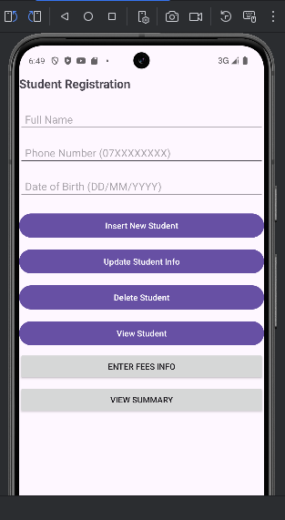
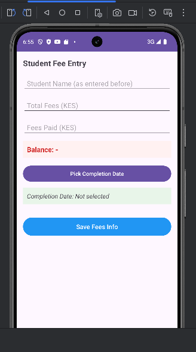
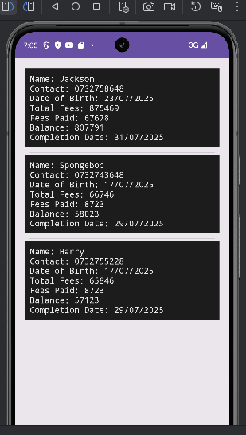

# Student Info Manager App 📚

An Android application for managing student records and fee payments using **SQLite**.  
Beginner Friendly Designed for educational institutions, or personal projects.

---

## 🎯 Features

-  Student registration (Name, Contact, Date of Birth)
-  Fee entry and live balance calculator
-  Completion date selection using DatePicker
-  Summary view for all students (including fees)
-  SQLite database with two normalized tables:
  - `Students`
  - `Fees`
-  Clean UI with structured layouts

---

## 📸 Screenshots

| Home | Fees | Summary |
|------|------|---------|
|  |  |  |

---

## 📦 APK Download

👉 [Click here to download the APK](https://github.com/kennethkimosop/StudentInfoManagerApp/releases/latest)

> You can install this APK directly on your Android device (enable unknown sources).

---

## 🧠 Tech Stack

- Java
- SQLite
- Android SDK
- XML Layouts

---

## 📁 Project Structure

```bash
📁 app/
 ┣ 📂 java/com/myfirst/sqliteapplication/
 ┃ ┣ MainActivity.java
 ┃ ┣ FeesActivity.java
 ┃ ┣ SummaryActivity.java
 ┃ ┗ DBHelper.java
 ┣ 📂 res/
 ┃ ┣ 📂 layout/
 ┃ ┃ ┣ activity_main.xml
 ┃ ┃ ┣ activity_fees.xml
 ┃ ┃ ┗ activity_summary.xml
 ┃ ┗ 📂 drawable/
 ┣ screenshots/
 ┃ ┣ main_screen.png
 ┃ ┣ fees_screen.png
 ┃ ┗ summary_screen.png
